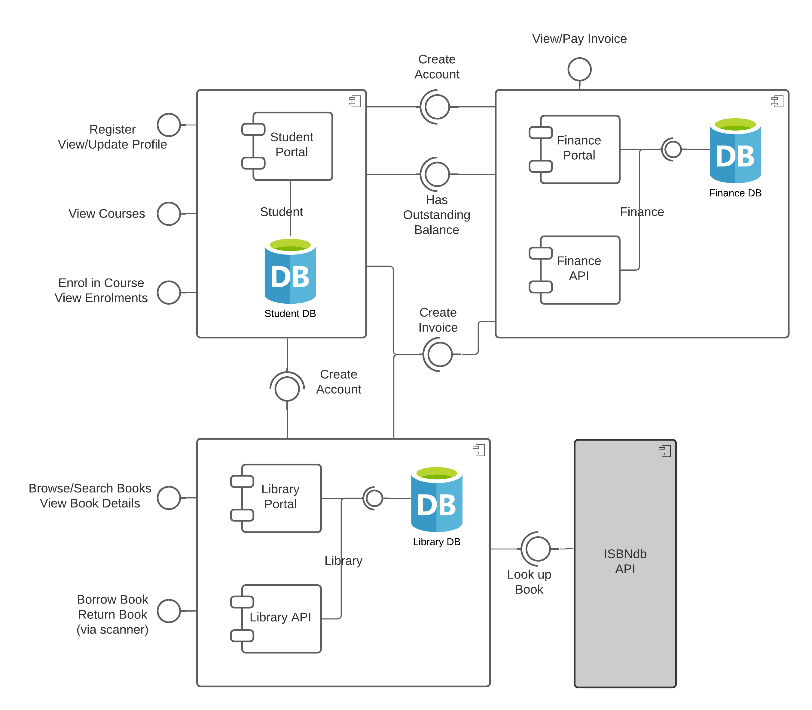

# Finance Application
This is a simple microservices-based application which exposes a RESTful API. It is written in Java using the Spring Boot framework. It is intended for use as part of the SESC module at Leeds Beckett University.

## Features
1. Create Account - create a finance account by passing a student ID.
2. Query Account - find a finance account by passing a student ID. The response shows whether the account has an outstanding balance.
3. View Invoice - view all invoices or a single invoice, by invoice ID.
4. Create Invoice - create a new outstanding invoice by passing a student ID.
5. Pay Invoice - pay an outstanding invoice.
6. Cancel Invoice - cancel an outstanding invoice.

## Integrations
1. The application integrates with a MariaDB relational database.
2. Scripts to create the database schema can be found in the migrations folder and are run automatically by docker-compose.

## Run using Docker Compose
1. Create a file called `.env` inside the `finance` directory and enter the following text (in separate lines): 
   `DB_APPLICATION_USER=XXXXXXXXX` 
   `DB_APPLICATION_PASSWORD=XXXXXXXXX` 
   `DB_ROOT_PASSWORD=XXXXXXXXX` 
   `DB_NAME=XXXXXXXXX` 
   (replace the XXXXXs)
3. From the `finance` directory, run the app and db services: 
   `docker-compose up`

## Test using Postman
Download Postman from https://www.postman.com/ and import the collections found in the `finance/postman` directory.

## Future Development
Create a simple web portal that allows users to pay invoices.

## Contributing
Pull requests are welcome. For major changes, please open an issue first to discuss what you would like to change.
Please make sure to update tests as appropriate.

## License
Copyright (c) 2021 Thalita Vergilio

Permission is hereby granted, free of charge, to any person obtaining a copy
of this software and associated documentation files (the "Software"), to deal
in the Software without restriction, including without limitation the rights
to use, copy, modify, merge, publish, distribute, sublicense, and/or sell
copies of the Software, and to permit persons to whom the Software is
furnished to do so, subject to the following conditions:

The above copyright notice and this permission notice shall be included in all
copies or substantial portions of the Software.

THE SOFTWARE IS PROVIDED "AS IS", WITHOUT WARRANTY OF ANY KIND, EXPRESS OR
IMPLIED, INCLUDING BUT NOT LIMITED TO THE WARRANTIES OF MERCHANTABILITY,
FITNESS FOR A PARTICULAR PURPOSE AND NONINFRINGEMENT. IN NO EVENT SHALL THE
AUTHORS OR COPYRIGHT HOLDERS BE LIABLE FOR ANY CLAIM, DAMAGES OR OTHER
LIABILITY, WHETHER IN AN ACTION OF CONTRACT, TORT OR OTHERWISE, ARISING FROM,
OUT OF OR IN CONNECTION WITH THE SOFTWARE OR THE USE OR OTHER DEALINGS IN THE
SOFTWARE.